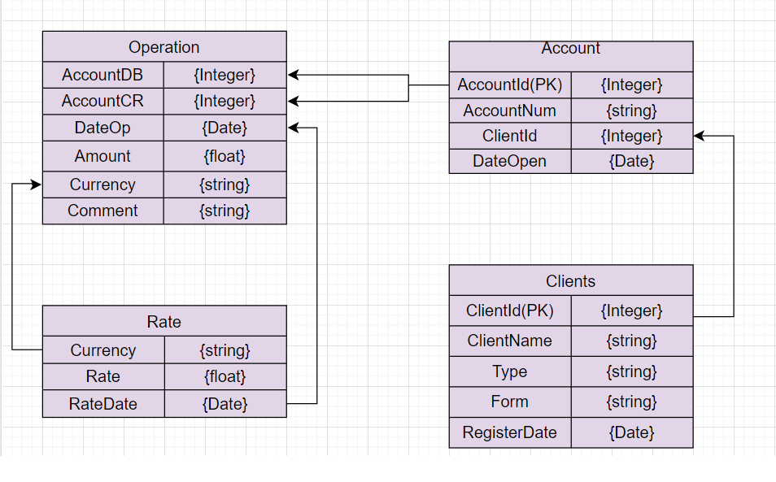

# Итоговый проект курса 1T DE

Данный проект является итоговой аттестацией по курсу "Инженер данных".

## Задача проекта

Продемонстрировать практические навыки, приобретенные во время прохождения курса на примере задачи формирования банковских витрин.

## Технологический стек

Для реализации данного проекта был выбран следующий стек

scala 2.11.08

spark 2.3.2

hadoop 2.3.2

Основным инструментом выбран Spark on Scala как один из наиболее удобных и мощных инструментов для работы с большими данными
## ER-диаграмма
Данные с разных таблиц объединяем с помощью джойнов. За основную таблицу берется таблица с операциями (Operation.csv)

 

## Структура проекта 

    ├── .gitignore
    ├── README.md   
    ├── Итоговая работа.pptx
    ├── Vitrina
    │   ├──2020-11-01
    │   │   ├── corporate_account
    │   │   ├── corporate_info
    │   │   └── corporate_payments
    |   ├──2020-11-02
    |   |   ├── corporate_account
    │   │   ├── corporate_info
    │   │   └── corporate_payments
    |   ├──2020-11-03
    |   |   ├── corporate_account
    │   │   ├── corporate_info
    │   │   └── corporate_payments
    |   ├──2020-11-04
    |       ├── corporate_account
    │       ├── corporate_info
    │       └── corporate_payments
    ├── Data   
    │    ├── Account.csv
    │    ├── Clients.csv
    │    ├── Operation.csv
    │    └── Rate.csv 
    ├── build.sbt
    ├── project
    │   └── build.properties
    └── src
        └── main
            └── scala
                └── Main.scala
 
## Алгоритм работы проекта

1. При запуске Main.scala происходит инициализация спарк сессии
2. Выгружаются все необходимые таблицы
3. Формируются курсы валют на отчетные даты
4. Из данных по операциям отбираются уникальные счета и дебета и кредита
5. Информация по счетам обогащается информацией по клиенту
6. Формируется основной фрейм, аналогичный фрейму с операциями, но обогащенный данными по счетам и клиентам
7. Пересчитываем суммы в рубли
8. Собираем агрегаты
9. Сохраняем витрину _corporate_payments_
10. На основе ранее собранных фреймов собираем и сохраняем _corporate_account_
11. На основе ранее собранных фреймов собираем и сохраняем _corporate_info_
